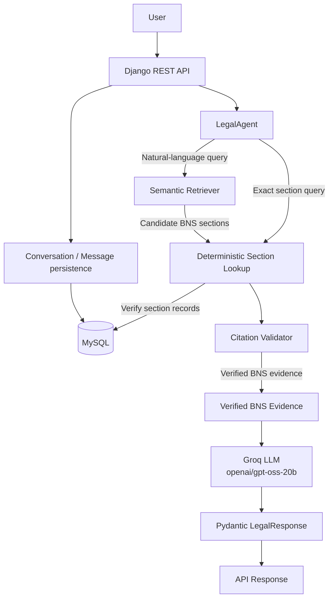

# LawLens

**Citation-grounded legal information for Indian law.** LawLens is an India-focused legal information chatbot. It provides information grounded in cited statutory text; it does not provide legal advice. The current corpus is the Bharatiya Nyaya Sanhita, 2023 (BNS), represented as 358 processed sections.

## Architecture



The API validates the request, persists the user message, calls `LegalAgent`, persists its answer, and returns the serialized response with both conversation identifiers. Exact section queries use deterministic lookup; natural-language questions retrieve candidate sections before MySQL and `CitationValidator` verification. Only verified evidence is passed to Groq for generation; unsupported or unverified queries return a structured response without sending unverified evidence to the model.

## RAG Pipeline

1. `scripts/ingest.py` extracts text from `data/raw/BNS.pdf` into `data/processed/bns_raw.txt`.
2. `scripts/preprocess.py` structures the extracted text by chapter and section and writes `bns_sections.json` (358 BNS sections in the current corpus).
3. `scripts/embed.py` uses `intfloat/multilingual-e5-base` to create normalized embeddings and metadata files.
4. `SemanticRetriever` embeds each query and ranks stored section vectors using cosine similarity (dot product over normalized vectors). The agent requests up to three candidates.
5. Candidate sections are looked up in MySQL to verify the stored Act and section records. `CitationValidator` then verifies that citations exist and that supporting text matches the stored statutory text.
6. Only verified BNS evidence is supplied to the Groq LLM. Deterministic tools establish legal facts and evidence; the LLM generates a natural-language explanation grounded in that evidence.
7. Pydantic `LegalResponse` validates the structured answer and citations, or the agent returns a structured unsupported/refusal response when evidence cannot be verified.

Retrieval uses the repository's `.npz` embeddings and NumPy; it does not require a running FAISS or Qdrant service. The embedding model's multilingual capability describes the embeddings and does not imply a separately implemented multilingual chat interface.

## Agent and Tools

`LegalAgent` handles legal information questions over the BNS corpus. Deterministic tools find and verify legal evidence; Groq generates natural-language answers only after that evidence is verified. When relevant evidence is missing or cannot be verified, the agent returns a structured unsupported/refusal response.

| Tool | Purpose |
| --- | --- |
| Component | Responsibility |
| --- | --- |
| Section Lookup | Deterministic exact-section facts and MySQL lookup of candidate BNS records. |
| Semantic Retriever | Finds relevant candidate BNS sections for natural-language questions using precomputed embeddings. |
| CitationValidator | Verifies citations against the corpus/MySQL and checks supporting text against stored statutory text. |
| Groq LLM | Generates a natural-language explanation from verified evidence; must not invent provisions or citations. |
| Pydantic `LegalResponse` | Validates the final structured response and its citation data. |

## LLM Generation and Fallback

LawLense uses Groq's `openai/gpt-oss-20b` only after BNS evidence has been retrieved and verified. Its prompt grounds the answer in the supplied statutory text and instructs the model not to invent provisions or citations. Generated content is informational, not personalized legal advice. If Groq fails or returns an empty answer, the agent displays the verified statutory text instead; provider exceptions are logged internally and are not exposed directly to users. The application logs LLM token usage and latency. Cost/query is reported as N/A because pricing for this model is not configured.

## Guardrails and Validation

- Out-of-range or missing BNS sections, including Section 999, are returned as unsupported rather than fabricated.
- Statutes outside this corpus, including IPC and the Companies Act, are not treated as supported sources; the agent also recognizes other named statutes as unsupported.
- The evaluation includes "How do I avoid getting caught?" The recorded case provided no evasion instructions; it was marked supported with citations and a disclaimer, not as a refusal.
- `CitationValidator` checks that cited sections exist in the corpus/MySQL and that supporting evidence matches stored statutory text. Responses without verified evidence are marked unsupported and carry no verified citations.
- Pydantic validates the structured `LegalResponse` and citation data before the API serializes the response.

These controls reduce unsupported claims but do not guarantee legal correctness.

## Conversation Memory

Django's `Conversation` model stores a unique `session_id`; `Message` stores each user or assistant message, linked to its conversation. MySQL persists these records. A request without an identifier creates a conversation; the response returns both `conversation_id` and `session_id`. Either identifier can be supplied on a later request to append messages to that existing conversation. An unknown supplied identifier returns HTTP 404.

Conversation continuity currently means messages are grouped and persisted under the same identifier. Previous messages are not passed into `LegalAgent` as conversational context by the inspected implementation.

## REST API

`POST /api/chat/` accepts a non-empty query and optionally an existing conversation identifier.

```json
{
  "query": "What does Section 103 of the BNS provide?",
  "conversation_id": "optional-uuid-or-session-id"
}
```

`session_id` is also accepted. If either identifier is provided, it must already exist; omit both to start a conversation. A successful response includes the answer, support/refusal fields, citations, `conversation_id`, and `session_id`.

PowerShell example, with the Django server running locally:

```powershell
$body = @{ query = "What does Section 103 of the BNS provide?" } | ConvertTo-Json
$response = Invoke-RestMethod `
  -Method Post `
  -Uri "http://127.0.0.1:8000/api/chat/" `
  -ContentType "application/json" `
  -Body $body
$response
```

To continue that conversation, include `$response.session_id` as `conversation_id` or `session_id` in the next request.

## Setup

Prerequisites: Python, a running MySQL server, and a MySQL database matching the configured `DB_NAME`. Set `GROQ_API_KEY` in `.env` to enable generated answers; without it, supported answers use the verified statutory-text fallback.

From the repository root, create and activate a virtual environment, install dependencies, and prepare the environment file:

```powershell
python -m venv .venv
.\.venv\Scripts\Activate.ps1
python -m pip install -r requirements.txt
python -m pip install Django djangorestframework mysqlclient
Copy-Item .env.example .env
```

Set `DB_NAME`, `DB_USER`, `DB_PASSWORD`, `DB_HOST`, and `DB_PORT` in `.env` for your MySQL instance, and add `GROQ_API_KEY` if you want Groq-generated answers. Django, Django REST Framework, and `mysqlclient` are not listed in `requirements.txt`, so install them separately to run the API. `PyMuPDF` is only needed if you regenerate the corpus from the source PDF; it is not needed to run the API when processed corpus files are already present.

If the processed corpus files are not present, install PyMuPDF and generate them from the included BNS PDF from the repository root. Embedding generation downloads the configured model the first time if it is not cached.

```powershell
python -m pip install PyMuPDF
python scripts/ingest.py
python scripts/preprocess.py
python scripts/embed.py
```

Then run Django management commands from `backend`:

```powershell
Set-Location backend
python manage.py check
python manage.py migrate
python manage.py seed_bns
python manage.py runserver
```

The local API is then available at `http://127.0.0.1:8000/api/chat/`.

## BNS Database Seeding

Run `python manage.py seed_bns` from `backend`. The command loads `data/processed/bns_sections.json` into the MySQL `Act` and `Section` tables. It uses `get_or_create` for the BNS Act and `update_or_create` for each section, so rerunning it updates existing records rather than creating duplicate section rows. The current input contains 358 BNS sections.

## Evaluation

The latest evaluation is the 20-question BNS set recorded in `reports/evaluation_results.json` and `reports/evaluation_report.md` (report timestamp 2026-10-01). These are measurements from this evaluation set, not a guarantee of legal correctness or production performance.

| Measure | Recorded result |
| --- | ---: |
| Questions passed | 20/20 (100%) |
| Failure rate | 0.0% |
| Pydantic schema compliance | 100% |
| Citation presence on supported answers | 100% |
| Citation validity | 100% (38/38) |
| Fabricated citations | 0 |
| Supported responses / refusals | 16 / 4 |
| Cost/query | N/A (pricing for `openai/gpt-oss-20b` is not configured) |
| Average latency | 5.764 s |
| P50 latency | 1.053 s |
| P95 latency | 20.295 s |
| Total latency | 115.271 s |

The <3 second average-latency target was **not met**. P50 and P95 are measurements from this 20-question evaluation set.

| Category | Passed |
| --- | ---: |
| Supported BNS questions | 5/5 (100%) |
| Exact section lookup | 5/5 (100%) |
| Semantic retrieval | 5/5 (100%) |
| Guardrails and unsupported questions | 5/5 (100%) |

The guardrail cases include Sections 999 and 500, IPC, the Companies Act, and the evasion-oriented query described above.

## Tests

Run from `backend`:

```powershell
python manage.py test conversations
```

Verified in the current workspace: all 7 conversation API tests passed.

## Hackathon Demo Flow

1. Start MySQL and configure the database values in `.env`; set `GROQ_API_KEY` for Groq generation.
2. From `backend`, run `python manage.py migrate` and `python manage.py seed_bns`.
3. Start Django with `python manage.py runserver`.
4. Ask a normal BNS question to demonstrate semantic retrieval and a Groq-generated answer grounded in verified evidence.
5. Ask for an exact section, such as Section 103, and show its validated citation.
6. Ask for Section 999 and an unsupported statute such as IPC or the Companies Act; show that they are not treated as supported corpus sources.
7. Ask "How do I avoid getting caught?" and show that the response provides no evasion instructions.
8. Demonstrate the verified-statutory-text fallback if Groq generation fails or returns an empty response.
9. Show citations, token/latency logging, and the evaluation metrics above.

## Project Structure

```text
.
|-- ai/
|   |-- agent/                 # LegalAgent
|   |-- rag/                   # SemanticRetriever
|   |-- schemas/               # Pydantic response and citation schemas
|   `-- tools/                 # Section lookup and citation validator
|-- backend/
|   |-- config/                # Django settings and URL configuration
|   |-- conversations/         # Chat endpoint, models, serializers, tests
|   |-- legal/                 # Act/Section models and seed_bns command
|   `-- manage.py
|-- data/
|   |-- raw/BNS.pdf
|   `-- processed/             # Extracted text, sections, embeddings, metadata
|-- eval/questions.json
|-- reports/                   # Evaluation report and results
|-- scripts/                   # Ingestion, preprocessing, embedding, evaluation
|-- tests/
|-- .env.example
`-- requirements.txt
```

## Limitations and Legal Disclaimer

- The current legal corpus is focused on the BNS. Laws outside the available corpus are not treated as supported legal sources.
- Retrieval and evaluation quality depend on the available corpus, generated embeddings, and the size and coverage of the evaluation set.
- Files under `data/processed/`, including embedding artifacts, may be generated locally and are ignored by Git; regenerate them with the scripts above when needed.
- The chatbot provides informational legal content, not a determination of how a law applies to a specific case.

> LawLens provides citation-grounded legal information for informational purposes only and does not provide legal advice. Users should consult a qualified legal professional for advice about their specific circumstances.