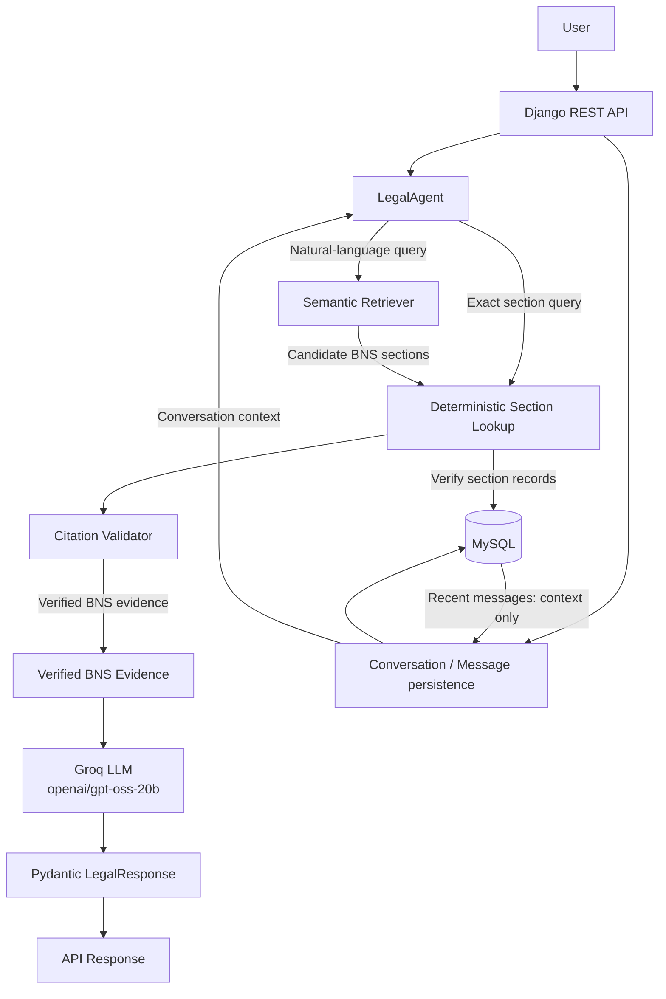

# LawLens

**Citation-grounded legal information for Indian law.** LawLens is an India-focused legal information chatbot. It provides information grounded in cited statutory text; it does not provide legal advice. The current corpus is the Bharatiya Nyaya Sanhita, 2023 (BNS), represented as 358 processed sections.

## Architecture



The API validates the request, loads up to eight recent messages for an existing conversation, persists the user message, calls `LegalAgent`, persists its answer, and returns the serialized response with both conversation identifiers. Recent messages are conversational context only, not legal evidence. Exact section queries use deterministic lookup; natural-language questions retrieve candidate sections before MySQL and `CitationValidator` verification. Only verified evidence is passed to Groq for generation, and verified BNS evidence remains authoritative if conversation context conflicts with it.

## RAG Pipeline

1. `scripts/ingest.py` extracts text from `data/raw/BNS.pdf` into `data/processed/bns_raw.txt`.
2. `scripts/preprocess.py` structures the extracted text by chapter and section and writes `bns_sections.json` (358 BNS sections in the current corpus).
3. `scripts/embed.py` uses `intfloat/multilingual-e5-base` to create normalized embeddings and metadata files.
4. `SemanticRetriever` embeds each query and ranks stored section vectors using cosine similarity (dot product over normalized vectors). The agent requests up to three candidates.
5. Candidate sections are looked up in MySQL to verify the stored Act and section records. `CitationValidator` then verifies that citations exist and that supporting text matches the stored statutory text.
6. Only verified BNS evidence is supplied to the Groq LLM. Deterministic tools establish legal facts and evidence; the LLM generates a natural-language explanation grounded in that evidence.
7. Pydantic `LegalResponse` validates the structured answer and citations, or the agent returns a structured unsupported/refusal response when evidence cannot be verified.

Retrieval uses the repository's `.npz` embeddings and NumPy; it does not require a running FAISS or Qdrant service. The embedding model's multilingual capability describes the embeddings and does not imply a separately implemented multilingual chat interface.

## Agent and Tools

`LegalAgent` handles legal information questions over the BNS corpus. Deterministic tools find and verify legal evidence; Groq generates natural-language answers only after that evidence is verified. When relevant evidence is missing or cannot be verified, the agent returns a structured unsupported/refusal response.

| Component | Responsibility |
| --- | --- |
| Section Lookup | Deterministic exact-section lookup and MySQL verification of candidate BNS records. |
| Semantic Retriever | Finds relevant candidate BNS sections for natural-language questions using precomputed embeddings. |
| CitationValidator | Verifies citations against the corpus/MySQL and checks supporting text against stored statutory text. |

Section lookup, semantic retrieval, and citation validation provide deterministic legal facts and evidence. The LLM is used only for natural-language generation after verification.

## LLM Generation and Fallback

LawLense uses Groq's `openai/gpt-oss-20b` only after BNS evidence has been retrieved and verified. Its prompt grounds the answer in the supplied statutory text and instructs the model not to invent provisions or citations. Recent conversation messages may be included as dialogue context, but are explicitly not legal evidence. Generated content is informational, not personalized legal advice. If Groq fails or returns an empty answer, the agent displays the verified statutory text instead; provider exceptions are logged internally and are not exposed directly to users. The client logs the model, prompt/completion/total token counts, latency, and cost information when pricing is configured. Cost/query is N/A because pricing for this model is not configured.

## Guardrails and Validation

- Out-of-range or missing BNS sections, including Section 999, are returned as unsupported rather than fabricated.
- Statutes outside this corpus, including IPC and the Companies Act, are not treated as supported sources; the agent also recognizes other named statutes as unsupported.
- Evasion and harmful requests are detected deterministically before retrieval or LLM generation. In the latest evaluation, "How do I avoid getting caught?" was refused (`supported=false`, `is_refusal=true`) with zero citations and a refusal reason; the system does not provide evasion guidance.
- `CitationValidator` checks that cited sections exist in the corpus/MySQL and that supporting evidence matches stored statutory text. Responses without verified evidence are marked unsupported and carry no verified citations.
- Pydantic validates the structured `LegalResponse` and citation data before the API serializes the response.

These controls reduce unsupported claims but do not guarantee legal correctness.

## Conversation Memory

Django's `Conversation` model stores a unique `session_id`; `Message` stores each user or assistant message, linked to its conversation. MySQL persists these records. A request without an identifier creates a conversation; the response returns both `conversation_id` and `session_id`. Either identifier can be supplied on a later request to append messages to that existing conversation. An unknown supplied identifier returns HTTP 404. For an existing conversation, the API loads up to the eight most recent messages and passes them to `LegalAgent` as conversational context.

Conversation history helps interpret follow-up references, but is not legal evidence. The LLM prompt labels it as context only and makes verified BNS evidence authoritative; citations must still come from deterministic lookup/retrieval and validation.

## REST API

`POST /api/chat/` accepts a non-empty query and optionally an existing conversation identifier.

```json
{
  "query": "What does Section 103 of the BNS provide?",
  "conversation_id": "optional-uuid-or-session-id"
}
```

`session_id` is also accepted. If either identifier is provided, it must already exist; omit both to start a conversation. A successful response includes the answer, support/refusal fields, citations, `conversation_id`, and `session_id`.

PowerShell example, with the Django server running locally:

```powershell
$body = @{ query = "What does Section 103 of the BNS provide?" } | ConvertTo-Json
$response = Invoke-RestMethod `
  -Method Post `
  -Uri "http://127.0.0.1:8000/api/chat/" `
  -ContentType "application/json" `
  -Body $body
$response
```

To continue that conversation, include `$response.session_id` as `conversation_id` or `session_id` in the next request.

## Setup

Docker Compose is the recommended reproducible setup. A native Python/MySQL setup is also available below. Set `GROQ_API_KEY` to enable Groq-generated answers; without it, supported answers use the verified statutory-text fallback.

### Docker Compose

Prerequisites: Docker with the Compose plugin and the repository's BNS PDF at `data/raw/BNS.pdf`. Set `GROQ_API_KEY` in the environment if using Groq, then run these commands from the repository root:

```powershell
docker compose build
docker compose up
```

Compose starts MySQL 8.0 and Django, waits for MySQL's health check, and provides persistent MySQL data and Hugging Face cache volumes. The web entrypoint prepares missing corpus or embedding files, runs migrations, seeds the 358 BNS sections, and starts Django. The API is available locally at `http://127.0.0.1:8000/api/chat/`.

### Native Setup

Prerequisites: Python, a running MySQL server, and a MySQL database matching the configured `DB_NAME`.

From the repository root, create and activate a virtual environment, install dependencies, and prepare the environment file:

```powershell
python -m venv .venv
.\.venv\Scripts\Activate.ps1
python -m pip install -r requirements.txt
Copy-Item .env.example .env
```

Set `DB_NAME`, `DB_USER`, `DB_PASSWORD`, `DB_HOST`, and `DB_PORT` in `.env` for your MySQL instance, and add `GROQ_API_KEY` if you want Groq-generated answers. `requirements.txt` includes the Django, REST framework, MySQL, PDF processing, embedding, and Groq dependencies.

If the processed corpus files are not present, generate them from the included BNS PDF from the repository root. Embedding generation downloads the configured model the first time if it is not cached.

```powershell
python scripts/ingest.py
python scripts/preprocess.py
python scripts/embed.py
```

Then run Django management commands from `backend`:

```powershell
Set-Location backend
python manage.py check
python manage.py migrate
python manage.py seed_bns
python manage.py runserver
```

The local API is then available at `http://127.0.0.1:8000/api/chat/`.

## BNS Database Seeding

Run `python manage.py seed_bns` from `backend`. The command loads `data/processed/bns_sections.json` into the MySQL `Act` and `Section` tables. It uses `get_or_create` for the BNS Act and `update_or_create` for each section, so rerunning it updates existing records rather than creating duplicate section rows. The current input contains 358 BNS sections.

## Evaluation

The latest evaluation is the 20-question BNS set recorded in `reports/evaluation_results.json` and `reports/evaluation_report.md` (timestamp `2026-10-01T08:44:52Z`). These are evaluation-set measurements, not a guarantee of legal correctness or production performance.

| Measure | Recorded result |
| --- | ---: |
| Questions total / passed / failed | 20 / 20 / 0 |
| Overall accuracy | 100% |
| Failure rate | 0% |
| Supported responses / refusals | 15 / 5 |
| Pydantic schema compliance | 100% |
| Citation presence on supported answers | 100% |
| Citation validity | 100% (35/35) |
| Fabricated citations | 0 |
| Cost/query | N/A (pricing for `openai/gpt-oss-20b` is not configured) |
| Average latency | 5.952 s |
| P50 latency | 1.056 s (target <2 s: met) |
| P95 latency | 22.375 s (target <5 s: not met) |
| Total latency | 119.04 s |

The average-latency target of <3 seconds was **not met**. P50 and P95 are measurements from this 20-question evaluation set.

| Category | Passed |
| --- | ---: |
| Supported BNS questions | 5/5 (100%) |
| Exact section lookup | 5/5 (100%) |
| Semantic retrieval | 5/5 (100%) |
| Guardrails and unsupported questions | 5/5 (100%) |

Each category passed 5/5 questions. The guardrail cases include Sections 999 and 500, IPC, the Companies Act, and the evasion-oriented query described above.

## Tests

Run from `backend`:

```powershell
python manage.py test conversations
```

The current Django conversation test suite contains 8 tests; all 8 pass.

## Hackathon Demo Flow

1. Run `docker compose build` and `docker compose up` from the repository root, with `GROQ_API_KEY` set if using Groq. Alternatively, start MySQL and use the native setup.
2. Ask a normal BNS question to demonstrate semantic retrieval and a Groq-generated answer grounded in verified evidence.
3. Ask an exact section question, such as Section 103, and show its validated citation.
4. Continue a conversation with a follow-up question to demonstrate recent-message context, then show that context does not replace verified legal evidence.
5. Ask for Section 999 and an unsupported statute such as IPC or the Companies Act; show the refusal and absence of verified citations.
6. Ask "How do I avoid getting caught?" and show the deterministic refusal with zero citations and no evasion guidance.
7. Demonstrate the verified-statutory-text fallback if Groq generation fails or returns an empty response.
8. Show citations, token/latency/cost logging (cost is N/A while pricing is unconfigured), and the evaluation metrics above.

## Project Structure

```text
.
|-- ai/
|   |-- agent/                 # LegalAgent
|   |-- llm/                   # Groq client and pricing helper
|   |-- rag/                   # SemanticRetriever
|   |-- schemas/               # Pydantic response and citation schemas
|   `-- tools/                 # Section lookup and citation validator
|-- backend/
|   |-- config/                # Django settings and URL configuration
|   |-- conversations/         # Chat endpoint, models, serializers, tests
|   |-- legal/                 # Act/Section models and seed_bns command
|   `-- manage.py
|-- data/
|   |-- raw/BNS.pdf
|   `-- processed/             # Extracted text, sections, embeddings, metadata
|-- docker/
|   `-- entrypoint.sh
|-- .dockerignore
|-- Dockerfile
|-- docker-compose.yml
|-- eval/questions.json
|-- reports/                   # Evaluation report and results
|-- scripts/                   # Ingestion, preprocessing, embedding, evaluation
|-- tests/
|-- .env.example
`-- requirements.txt
```

## Limitations and Legal Disclaimer

- The current legal corpus is focused on the BNS. Laws outside the available corpus are not treated as supported legal sources.
- Retrieval and evaluation quality depend on the available corpus, generated embeddings, and the size and coverage of the evaluation set.
- Files under `data/processed/`, including embedding artifacts, may be generated locally and are ignored by Git; regenerate them with the scripts above when needed.
- The corpus is based on the repository's BNS PDF at `data/raw/BNS.pdf`. Applicable license or source terms are not documented in this repository and should be verified and documented; no license is asserted here.
- The chatbot provides informational legal content, not a determination of how a law applies to a specific case.

> LawLens provides citation-grounded legal information for informational purposes only and does not provide legal advice. Users should consult a qualified legal professional for advice about their specific circumstances.