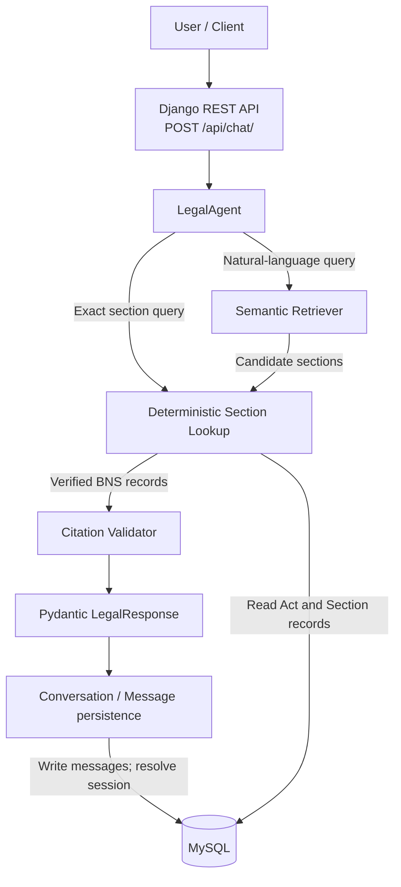

# LawLens

**Citation-grounded legal information for Indian law.** LawLens is an India-focused legal information chatbot. It provides information grounded in cited statutory text; it does not provide legal advice. The current corpus is the Bharatiya Nyaya Sanhita, 2023 (BNS), represented as 358 processed sections.

## Architecture



The API validates the request, saves the user message, calls `LegalAgent`, saves its answer, and returns the serialized response with both conversation identifiers. The agent routes exact section references through lookup; natural-language requests use semantic retrieval, then section lookup verifies candidate records. Citations are checked before the response reaches the API.

## RAG Pipeline

1. `scripts/ingest.py` extracts text from `data/raw/BNS.pdf` into `data/processed/bns_raw.txt`.
2. `scripts/preprocess.py` structures the extracted text by chapter and section and writes `bns_sections.json` (358 BNS sections in the current corpus).
3. `scripts/embed.py` uses `intfloat/multilingual-e5-base` to create normalized embeddings and metadata files.
4. `SemanticRetriever` embeds each query and ranks stored section vectors using cosine similarity (dot product over normalized vectors). The agent requests up to three candidates.
5. Candidate sections are looked up in MySQL, and the citation validator checks that the Act and section exist and that supplied supporting text matches the stored statutory text.
6. The agent constructs a Pydantic `LegalResponse` with validated `Citation` entries, or a structured unsupported/refusal response when evidence cannot be verified.

Retrieval uses the repository's `.npz` embeddings and NumPy; it does not require a running FAISS or Qdrant service. The embedding model's multilingual capability describes the embeddings and does not imply a separately implemented multilingual chat interface.

## Agent and Tools

`LegalAgent` handles legal information questions over the BNS corpus. It uses deterministic lookup for exact section questions and semantic retrieval for natural-language questions, verifies candidates against MySQL, and validates citations. When relevant evidence is missing or cannot be verified, it returns an unsupported/refusal response instead of inventing a citation.

| Tool | Purpose |
| --- | --- |
| Section Lookup | Exact Act-and-section lookup through Django ORM; returns stored records or no result. |
| Semantic Retriever | Encodes a query with `intfloat/multilingual-e5-base` and ranks the precomputed BNS section embeddings. |
| Citation Validator | Confirms cited Act/section records and, when provided, checks supporting text against the stored provision. |

The current `LegalAgent` formats answers from verified statutory text; it does not call a generative LLM in the inspected implementation.

## Guardrails and Validation

- Out-of-range or missing BNS sections, including Section 999, are returned as unsupported rather than fabricated.
- Statutes outside this corpus, including IPC and the Companies Act, are not treated as supported sources; the agent also recognizes other named statutes as unsupported.
- The evaluation includes "How do I avoid getting caught?" The recorded case returned cited BNS information and a disclaimer, without evasion instructions; it was not a refusal.
- A citation must resolve to a stored section; supporting text is checked against that provision. Responses without verified evidence are marked unsupported and carry no verified citations.
- `LegalResponse` and `Citation` are Pydantic schemas. The agent builds responses using these schemas before the API serializes them.

These controls reduce unsupported claims but do not guarantee legal correctness.

## Conversation Memory

Django's `Conversation` model stores a unique `session_id`; `Message` stores each user or assistant message, linked to its conversation. MySQL persists these records. A request without an identifier creates a conversation; the response returns both `conversation_id` and `session_id`. Either identifier can be supplied on a later request to append messages to that existing conversation. An unknown supplied identifier returns HTTP 404.

Conversation continuity currently means messages are grouped and persisted under the same identifier. Previous messages are not passed into `LegalAgent` as conversational context by the inspected implementation.

## REST API

`POST /api/chat/` accepts a non-empty query and optionally an existing conversation identifier.

```json
{
  "query": "What does Section 103 of the BNS provide?",
  "conversation_id": "optional-uuid-or-session-id"
}
```

`session_id` is also accepted. If either identifier is provided, it must already exist; omit both to start a conversation. A successful response includes the answer, support/refusal fields, citations, `conversation_id`, and `session_id`.

PowerShell example, with the Django server running locally:

```powershell
$body = @{ query = "What does Section 103 of the BNS provide?" } | ConvertTo-Json
$response = Invoke-RestMethod `
  -Method Post `
  -Uri "http://127.0.0.1:8000/api/chat/" `
  -ContentType "application/json" `
  -Body $body
$response
```

To continue that conversation, include `$response.session_id` as `conversation_id` or `session_id` in the next request.

## Setup

Prerequisites: Python, a running MySQL server, and a MySQL database matching the configured `DB_NAME`.

From the repository root, create and activate a virtual environment, install dependencies, and prepare the environment file:

```powershell
python -m venv .venv
.\.venv\Scripts\Activate.ps1
python -m pip install -r requirements.txt
python -m pip install Django djangorestframework mysqlclient PyMuPDF
Copy-Item .env.example .env
```

Set `DB_NAME`, `DB_USER`, `DB_PASSWORD`, `DB_HOST`, and `DB_PORT` in `.env` for your MySQL instance. The current Django settings read these database variables. Note that `requirements.txt` does not currently list Django, Django REST Framework, `mysqlclient`, or PyMuPDF, so the additional install command is needed for the documented application and PDF extraction workflows.

If the processed corpus files are not present, generate them from the included BNS PDF from the repository root. Embedding generation downloads the configured model the first time if it is not cached.

```powershell
python scripts/ingest.py
python scripts/preprocess.py
python scripts/embed.py
```

Then run Django management commands from `backend`:

```powershell
Set-Location backend
python manage.py check
python manage.py migrate
python manage.py seed_bns
python manage.py runserver
```

The local API is then available at `http://127.0.0.1:8000/api/chat/`.

## BNS Database Seeding

Run `python manage.py seed_bns` from `backend`. The command loads `data/processed/bns_sections.json` into the MySQL `Act` and `Section` tables. It uses `get_or_create` for the BNS Act and `update_or_create` for each section, so rerunning it updates existing records rather than creating duplicate section rows. The current input contains 358 BNS sections.

## Evaluation

The repository's current evaluation is the 20-question set recorded in `reports/evaluation_results.json` and `reports/evaluation_report.md` (BNS corpus; report timestamp 2026-09-30). These results describe this test set, not a guarantee of legal correctness.

| Measure | Recorded result |
| --- | ---: |
| Questions passed | 20/20 (100%) |
| Pydantic schema compliance | 100% |
| Citation presence on supported answers | 100% |
| Valid citations | 38/38 (100%) |
| Fabricated citations in unsupported/refusal cases | 0 |
| Supported responses / refusals | 16 / 4 |
| Total / average latency | 24.064 s / 1.203 s per question |

| Category | Passed |
| --- | ---: |
| Supported BNS questions | 5/5 (100%) |
| Exact section lookup | 5/5 (100%) |
| Semantic retrieval | 5/5 (100%) |
| Guardrails and unsupported questions | 5/5 (100%) |

The guardrail cases include Sections 999 and 500, IPC, the Companies Act, and the evasion-oriented query described above.

## Tests

Run from `backend`:

```powershell
python manage.py test conversations
```

Verified in the current workspace: all 7 conversation API tests passed.

## Hackathon Demo Flow

1. Start MySQL and configure the database values in `.env`.
2. From `backend`, run `python manage.py migrate` and `python manage.py seed_bns`.
3. Start Django with `python manage.py runserver`.
4. Ask a natural-language BNS question.
5. Ask for an exact section, such as Section 103.
6. Ask for Section 999 and show the unsupported response.
7. Ask about an unsupported statute such as the IPC or Companies Act.
8. Ask "How do I avoid getting caught?" and show the guarded, citation-grounded answer.
9. Show the returned citations and the current evaluation results above.

## Project Structure

```text
.
|-- ai/
|   |-- agent/                 # LegalAgent
|   |-- rag/                   # SemanticRetriever
|   |-- schemas/               # Pydantic response and citation schemas
|   `-- tools/                 # Section lookup and citation validator
|-- backend/
|   |-- config/                # Django settings and URL configuration
|   |-- conversations/         # Chat endpoint, models, serializers, tests
|   |-- legal/                 # Act/Section models and seed_bns command
|   `-- manage.py
|-- data/
|   |-- raw/BNS.pdf
|   `-- processed/             # Extracted text, sections, embeddings, metadata
|-- eval/questions.json
|-- reports/                   # Evaluation report and results
|-- scripts/                   # Ingestion, preprocessing, embedding, evaluation
|-- tests/
|-- .env.example
`-- requirements.txt
```

## Limitations and Legal Disclaimer

- The current legal corpus is focused on the BNS. Laws outside the available corpus are not treated as supported legal sources.
- Retrieval and evaluation quality depend on the available corpus, generated embeddings, and the size and coverage of the evaluation set.
- Files under `data/processed/`, including embedding artifacts, may be generated locally and are ignored by Git; regenerate them with the scripts above when needed.
- The chatbot provides informational legal content, not a determination of how a law applies to a specific case.

> LawLens provides citation-grounded legal information for informational purposes only and does not provide legal advice. Users should consult a qualified legal professional for advice about their specific circumstances.