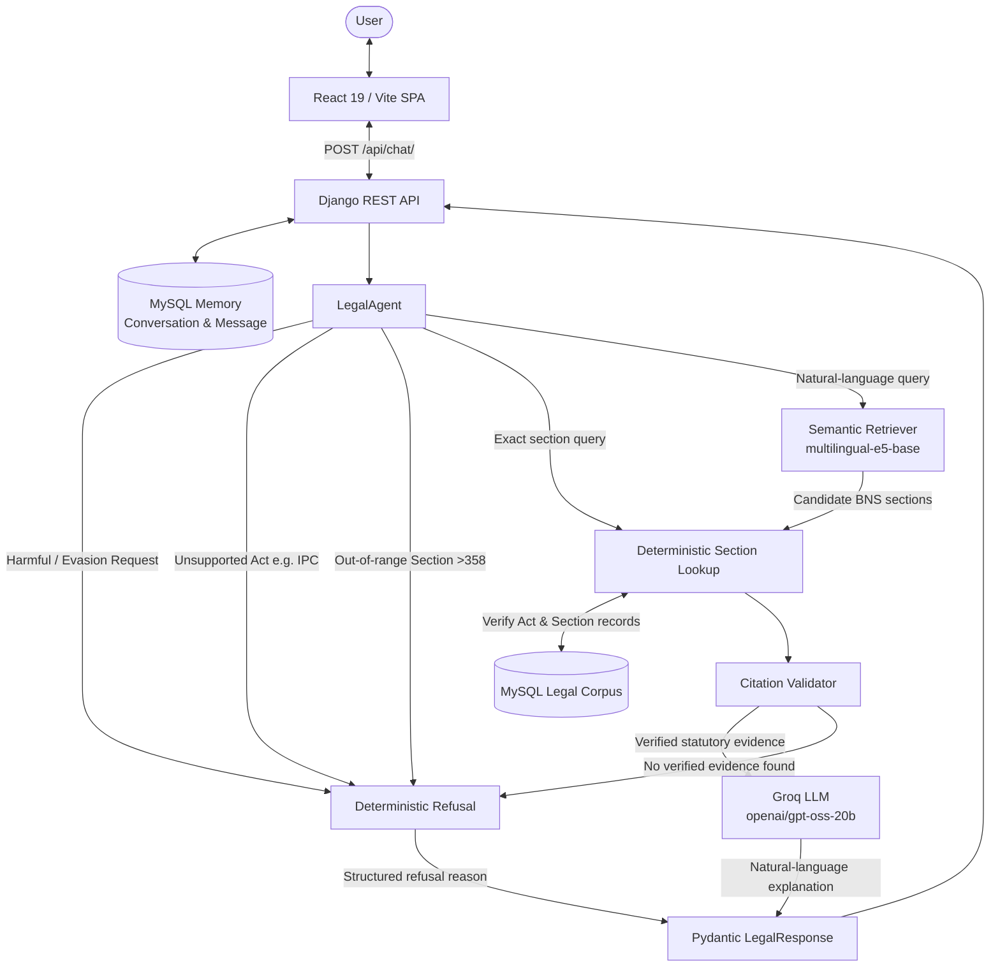

# LawLens

**Citation-grounded legal information assistant for the Bharatiya Nyaya Sanhita, 2023 (BNS).**

LawLens is an India-focused legal information assistant built around a core architectural principle:

> **"The LLM handles language. Tools handle facts, math, and decisions."**

LawLens provides objective legal information grounded in verified statutory text from the Bharatiya Nyaya Sanhita, 2023 (358 processed sections). It does **not** provide personalized legal advice, case predictions, or attorney-client representation.

---

## Architecture Flow

The system coordinates a modern React frontend, a Django REST backend, an orchestrating legal agent, deterministic MySQL tools, vector retrieval, and a grounded LLM:



**End-to-End Execution Flow:**
1. **User interaction**: The user submits a query through the React interface.
2. **API & Session Handling**: Django's `POST /api/chat/` validates input, retrieves up to 8 recent messages for conversation context, and persists the user message in MySQL.
3. **LegalAgent Routing**:
   - **Guardrails**: Rejects evasion requests, unsupported statutes (e.g., IPC), and out-of-range sections deterministically before calling the LLM.
   - **Deterministic Lookup**: Direct section queries (e.g., "Section 103") query MySQL directly.
   - **Semantic Retrieval**: Natural-language questions query precomputed BNS vector embeddings using cosine similarity.
4. **Citation & Evidence Verification**: Candidate provisions are verified against MySQL and checked via `CitationValidator` against stored statutory text.
5. **Grounded Generation**: Only verified BNS excerpts are provided to the Groq LLM (`openai/gpt-oss-20b`). If the LLM is unreachable or disabled, the agent falls back to verified statutory text.
6. **Pydantic Validation**: `LegalResponse` validates citations and structural constraints before returning JSON to the client.

---

## RAG Pipeline

1. **Ingestion (`scripts/ingest.py`)**: Extracts raw statutory text from the official BNS document (`data/raw/BNS.pdf`) into `data/processed/bns_raw.txt`.
2. **Preprocessing (`scripts/preprocess.py`)**: Parses the text into structured chapters and sections, creating `data/processed/bns_sections.json` (358 BNS sections).
3. **Embeddings (`scripts/embed.py`)**: Generates normalized dense vector embeddings using `intfloat/multilingual-e5-base` via `sentence-transformers`, saved as `data/processed/bns_embeddings.npz` with metadata in `bns_metadata.json`.
4. **Dense Vector Retrieval (`ai/rag/retriever.py`)**: Computes query embeddings with the `"query: "` prefix and performs cosine similarity ranking using NumPy dot products over normalized vectors.
5. **Deterministic Fact Grounding**: Semantic candidates are cross-checked against MySQL records and validated by `CitationValidator` before language generation.

*Note: Retrieval relies on local NumPy array computations over `.npz` files and does not require an external vector database service such as FAISS or Qdrant.*

---

## Legal Agent and Real Tools

The `LegalAgent` (`ai/agent/agent.py`) coordinates three concrete tools implemented in the repository:

| Tool | Implementation | Responsibility |
| --- | --- | --- |
| **Deterministic Section Lookup** | `ai/tools/section_lookup.py` | Performs exact-match queries and verifies section existence against the MySQL `legal_section` table. |
| **Semantic Retriever** | `ai/rag/retriever.py` | Retrieves top-$k$ candidate sections using `multilingual-e5-base` embeddings and cosine similarity. |
| **Citation Validator** | `ai/tools/citation_validator.py` | Verifies cited sections exist in the corpus and validates supporting evidence against stored statutory text. |

Tools provide factual retrieval and statutory validation; the LLM is restricted to synthesizing natural-language explanations.

---

## Guardrails and Refusal Handling

LawLens implements deterministic safety and scope controls prior to retrieval and generation:

- **Evasion & Harmful Request Refusal**: Catches queries seeking instructions on evading arrest, escaping detection, or committing offences (`_detect_evasion_or_harmful_request`). Returns `supported=False`, `is_refusal=True`, and zero citations, while preserving legitimate statutory inquiries (e.g., asking for the penalty for evading arrest).
- **Unsupported Statute Guardrail**: Inquiries about external statutes (e.g., Indian Penal Code / IPC, Companies Act, CrPC) are refused immediately with an explanation that the corpus is limited to the BNS.
- **Out-of-Range Section Guardrail**: Requests for nonexistent BNS sections (e.g., Section 999 or Section 500) are refused without fabricating citations.
- **Unverified Evidence Refusal**: If candidate sections cannot be verified or matched against statutory text, the agent returns a refusal rather than ungrounded claims.
- **Verified Statutory Fallback**: If Groq is unavailable, the system displays verified statutory text without exposing internal error messages to users.

---

## Pydantic Output Validation

Every response is validated against Pydantic models in `ai/schemas/response.py`:

- **`LegalResponse`**: Enforces business constraints:
  - Supported answers must contain at least one verified `Citation`.
  - Refusals and unsupported responses must have `supported=False`, `is_refusal=True`, and zero citations.
  - Section representations are normalized consistently.
- **`Citation`**: Validates the Act name (`BNS`), normalized section identifier, title, statutory excerpt, and source metadata.

---

## Conversational Memory

- **Persistence Layer**: Django models `Conversation` and `Message` in `backend/conversations/models.py` store multi-turn chat sessions in MySQL.
- **Session Identification**: Requests accept either `conversation_id` or `session_id`. Initial queries generate a new UUID; subsequent queries pass the ID to continue the conversation.
- **Context vs. Evidence Boundary**: The API loads up to the 8 most recent messages chronologically. This history is passed to the agent as dialogue context only and is explicitly labeled as non-evidential. Verified BNS evidence remains strictly authoritative.

---

## LLM Integration & Cost Tracking

- **Provider & Model**: Groq API using `openai/gpt-oss-20b`.
- **System Prompting**: Constrains output to the provided BNS excerpts and instructs the model not to invent legal provisions.
- **Usage & Cost Tracking**: Captures prompt tokens, completion tokens, total tokens, latency, and estimated cost calculated in `ai/llm/pricing.py`.
- **Configured Pricing**:
  - Prompt tokens: $0.075 per 1,000,000 tokens
  - Completion tokens: $0.30 per 1,000,000 tokens
  - Measured historical evaluation cost: **$0.000146 per query** ($0.002928 across 20 evaluation queries).

---

## REST API Specification

### Endpoint: `POST /api/chat/`

**Request Headers:** `Content-Type: application/json`

**Request Body (Initial Query):**
```json
{
  "query": "What does Section 103 of the BNS provide?"
}
```

**Request Body (Follow-Up Query):**
```json
{
  "query": "What is the punishment specified in this section?",
  "conversation_id": "3fa85f64-5717-4562-b3fc-2c963f66afa6"
}
```

**Response Body (Supported Answer):**
```json
{
  "query": "What does Section 103 of the BNS provide?",
  "answer": "Section 103 of the Bharatiya Nyaya Sanhita, 2023 deals with punishment for murder...",
  "supported": true,
  "citations": [
    {
      "act": "BNS",
      "section": "103",
      "title": "Punishment for murder",
      "supporting_text": "Whoever commits murder shall be punished with death or imprisonment for life...",
      "source": "Bharatiya Nyaya Sanhita, 2023"
    }
  ],
  "refusal_reason": null,
  "is_refusal": false,
  "language": "en",
  "conversation_id": "3fa85f64-5717-4562-b3fc-2c963f66afa6",
  "session_id": "3fa85f64-5717-4562-b3fc-2c963f66afa6"
}
```

**Response Body (Refusal):**
```json
{
  "query": "What does Section 999 of the BNS provide?",
  "answer": "Section 999 does not exist in the BNS legal corpus...",
  "supported": false,
  "citations": [],
  "refusal_reason": "Section 999 does not exist in the BNS legal corpus.",
  "is_refusal": true,
  "language": "en",
  "conversation_id": "3fa85f64-5717-4562-b3fc-2c963f66afa6",
  "session_id": "3fa85f64-5717-4562-b3fc-2c963f66afa6"
}
```

---

## Frontend Application

The user interface in `frontend/` is a lightweight Single-Page Application (SPA) built with:
- **React 19, TypeScript, and Vite 8**
- **Lucide React** for legal iconography
- **Custom CSS Design Tokens**: Deep navy (`#0B132B`), warm slate, and accessible high-contrast text.

### Key Features:
- **Hero Landing Screen**: Displays system capabilities and 6 suggested legal queries.
- **Interactive Citation Cards**: Collapsible cards displaying Act, Section, Title, verbatim statutory excerpts, and one-click clipboard copying.
- **High-Contrast User Bubbles**: High-contrast text on dark navy message bubbles exceeding WCAG AAA standards.
- **Refusal Banners**: Clear, neutral scope notices when queries cannot be answered from the BNS corpus.
- **Session Memory & Reset**: Maintains the active `conversation_id` across turns and provides a "New Conversation" button to clear state.
- **Development Proxy**: Vite dev server reverse proxies `/api/*` to the Django backend to eliminate local CORS friction.

---

## Docker & Container Architecture

- **`Dockerfile`**: Single-stage build based on `python:3.11-slim` installing MySQL client and build dependencies, pre-installing CPU-only PyTorch (`--index-url https://download.pytorch.org/whl/cpu`) to avoid multi-gigabyte CUDA/NVIDIA packages, PyMuPDF, and project requirements.
- **`docker-compose.yml`**: Defines two services:
  - `mysql`: MySQL 8.0 with persistent volume storage and health checks.
  - `web`: Django application container waiting on MySQL health before starting.
- **`docker/entrypoint.sh`**: Verifies database connectivity, executes database migrations, seeds BNS sections if missing, and starts the server.

*Technical Caveats: The Docker setup is configured for local evaluation and containerization. Inference is executed entirely on CPU (no GPU acceleration configured). Initial image builds require downloading PyTorch and embedding weights. The application has not been deployed to any remote production cloud environment.*

---

## Evaluation Results

The repository includes a checked-in 20-question reproducible evaluation recorded in `reports/evaluation_results.json` and `reports/evaluation_report.md` (historical run timestamp: `2026-10-01T09:25:31Z`):

| Metric | Historical Recorded Result | Evaluation Target | Status |
| :--- | :---: | :---: | :---: |
| **Questions Passed** | **20 / 20** | 20 / 20 | PASS (100.0%) |
| **Failure Rate** | **0.0%** | 0.0% | PASS |
| **Pydantic Compliance** | **100.0%** (20/20) | 100.0% | PASS |
| **Citation Validity Rate** | **100.0%** (35/35 citations) | 100.0% | PASS |
| **Fabricated Citations** | **0** | 0 | PASS |
| **Cost Per Query** | **$0.000146** | N/A | Actual token usage via Groq |
| **Total Evaluation Cost** | **$0.002928** | N/A | Total across 20 questions |
| **Average Latency** | **6.564s** | < 3s | NOT MET |
| **P50 Latency** | **1.477s** | < 2s | PASS |
| **P95 Latency** | **22.533s** | < 5s | NOT MET |

*Note: These figures reflect the checked-in historical evaluation dataset of 20 benchmark questions. Latency varies depending on local CPU embedding generation and Groq API response times.*

---

## Local Setup & Quickstart

### Prerequisites
- Python 3.10+ (tested on Python 3.11)
- MySQL Server 8.0+
- Node.js v18+ and npm v9+ (for frontend)
- Groq API Key (optional, enables LLM explanations; fallback displays statutory text)

### Backend Setup (Native)

1. **Clone and create virtual environment:**
   ```bash
   git clone <repo-url>
   cd LawLense
   python -m venv .venv
   source .venv/bin/activate  # On Windows: .\.venv\Scripts\Activate.ps1
   pip install -r requirements.txt
   ```

2. **Configure environment:**
   ```bash
   cp .env.example .env
   # Edit .env with your DB_NAME, DB_USER, DB_PASSWORD, DB_HOST, DB_PORT, and GROQ_API_KEY
   ```

3. **Generate processed corpus & embeddings (if not already present):**
   ```bash
   python scripts/ingest.py
   python scripts/preprocess.py
   python scripts/embed.py
   ```

4. **Run database migrations and seed the BNS corpus:**
   ```bash
   cd backend
   python manage.py migrate
   python manage.py seed_bns
   python manage.py runserver
   ```
   *The backend will be available at `http://127.0.0.1:8000`.*

### Frontend Setup

1. **Install dependencies and launch Vite:**
   ```bash
   cd frontend
   npm install
   npm run dev
   ```
   *The frontend will be available at `http://localhost:5173`.*

### Docker Compose Setup (Alternative)

```bash
docker compose build
docker compose up
```

---

## Verification & Testing

- **Backend tests:**
  ```bash
  python backend/manage.py test conversations
  ```
  *(8 tests verifying API chat flow, session memory, guardrails, and refusal formatting).*
- **Frontend lint & build:**
  ```bash
  cd frontend
  npm run lint
  npm run build
  ```
- **Evaluation suite:**
  ```bash
  python scripts/evaluate.py
  ```

---

## Limitations and Legal Disclaimer

1. **Corpus Scope**: Limited strictly to the 358 sections of the Bharatiya Nyaya Sanhita, 2023. Other major acts (BNSS, BSA, IPC, CrPC, Special/Local Laws) are not indexed.
2. **Data Source & Licensing**: The statutory text is derived from `data/raw/BNS.pdf`. The repository does not assert copyright over official statutory text, and formal upstream licensing terms remain unverified.
3. **No Legal Advice**: LawLens is an automated informational retrieval tool. It does not provide legal advice, representation, or authoritative case evaluations. Users must consult qualified legal professionals for real-world legal matters.
