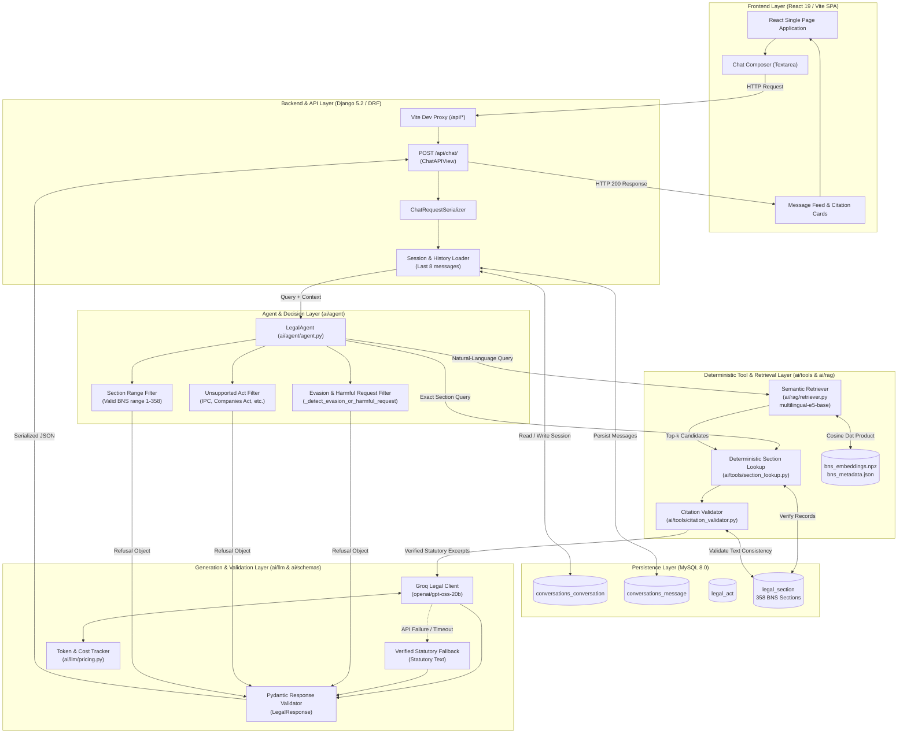
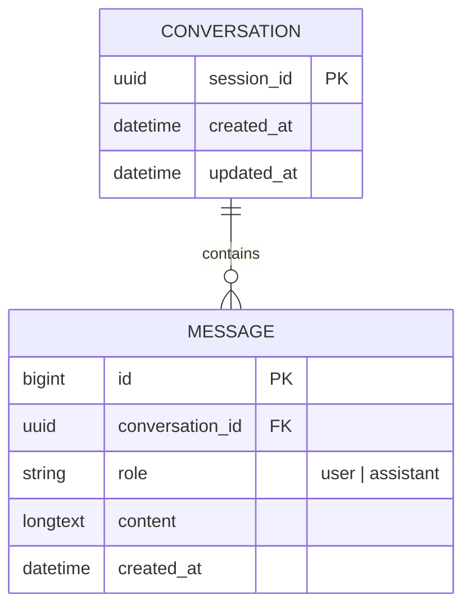
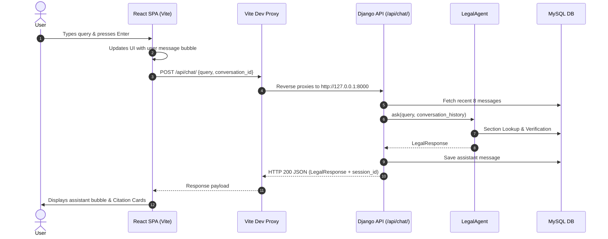
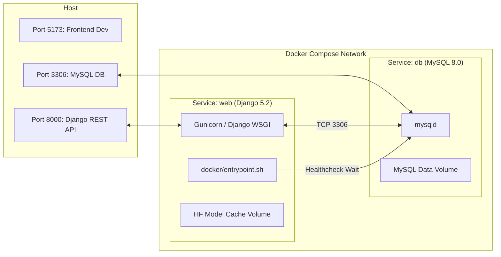
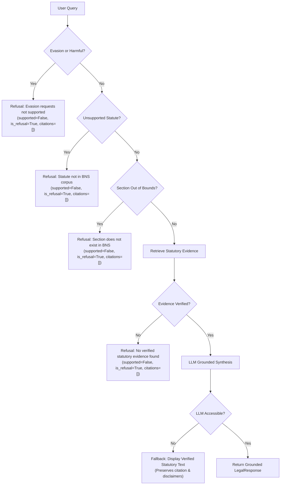

# LawLens — Technical Architecture Specification

> **Citation-grounded legal information assistant for the Bharatiya Nyaya Sanhita, 2023 (BNS).**

---

## 1. System Overview

LawLens is an India-focused legal artificial intelligence system designed to provide objective, evidence-grounded information on the **Bharatiya Nyaya Sanhita, 2023 (BNS)**. The application adheres to a fundamental architectural principle:

> **"The LLM handles language. Tools handle facts, math, and decisions."**

The system rejects end-to-end generative hallucination by decoupling information retrieval and verification from language synthesis:
1. **Deterministic Tools**: Identify, verify, and extract statutory provisions directly from a structured MySQL corpus and precomputed vector embeddings.
2. **Citation Validation**: Formally verifies every candidate citation and ensures supporting evidence exactly matches stored statutory provisions.
3. **Language Model (LLM)**: Operates strictly downstream of verification, synthesizing explanations grounded solely in verified statutory excerpts.
4. **Output Enforcement**: Pydantic schemas validate all output structures before responses reach the client.

LawLens provides objective legal information for research and education. It does **not** provide legal advice, personalized counsel, or litigation forecasting.

---

## 2. High-Level Architecture Diagram



---

## 3. End-to-End Request and Response Flow

A user request proceeds through seven distinct execution stages:

```text
[User Query]
     │
     ▼
1. Frontend Client (React SPA)
   - Checks input validity.
   - Attaches stored `conversation_id` (if continuing a session).
   - Issues POST request to `/api/chat/`.
     │
     ▼
2. Django REST Framework Layer
   - Validates payload via `ChatRequestSerializer`.
   - Resolves or creates `Conversation` record in MySQL.
   - Loads up to 8 recent messages chronologically for conversational context.
   - Persists user query as `Message(role="user")`.
     │
     ▼
3. LegalAgent Pre-Retrieval Guardrails
   - Scans query against `EVASION_HARMFUL_PATTERNS` regex suite.
   - Scans query against `UNSUPPORTED_ACTS` regex suite (e.g., IPC, CrPC).
   - If triggered: Instantly returns a structured `LegalResponse(supported=False, is_refusal=True)`.
     │
     ▼
4. Retrieval Routing
   - Path A (Exact Section): Regex detects explicit section patterns (e.g., "Section 103").
     Invokes `SectionLookup` against MySQL `legal_section`.
   - Path B (Semantic / Natural Language): Encodes query with `multilingual-e5-base`.
     Performs cosine dot-product similarity against precomputed BNS embeddings matrix.
     Returns top-$k$ (default 3) candidate sections.
     │
     ▼
5. Tool Verification & Citation Validation
   - Candidate provisions are verified against MySQL `legal_section`.
   - `CitationValidator` ensures sections exist in the database and verifies that statutory excerpts match stored text.
   - If no candidate passes verification: Refuses with structured `LegalResponse(supported=False)`.
     │
     ▼
6. Language Model Generation & Fallback
   - Verified statutory text is formatted into the Groq prompt.
   - Recent messages are passed as non-evidential dialogue context.
   - Groq generates natural-language explanation (`openai/gpt-oss-20b`).
   - If Groq fails or times out: Fallback automatically returns verified statutory text with disclaimer.
   - Token counts, latency, and costs are tracked via `ai/llm/pricing.py`.
     │
     ▼
7. Pydantic Validation & Persistence
   - Output validated by `LegalResponse` Pydantic model.
   - Assistant response persisted to MySQL as `Message(role="assistant")`.
   - HTTP 200 JSON returned to React frontend.
```

---

## 4. RAG Pipeline Architecture

The Retrieval-Augmented Generation pipeline is composed of offline ingestion and indexing scripts, paired with an online dense retriever.

```text
OFFLINE PREPARATION
┌────────────────┐     scripts/ingest.py     ┌────────────────┐
│ data/raw/      │ ────────────────────────> │ data/processed/│
│ BNS.pdf        │                           │ bns_raw.txt    │
└────────────────┘                           └───────┬────────┘
                                                     │ scripts/preprocess.py
                                                     ▼
┌────────────────┐      scripts/embed.py     ┌────────────────┐
│ data/processed/│ <──────────────────────── │ data/processed/│
│ embeddings.npz │   multilingual-e5-base    │ bns_sections   │
│ metadata.json  │                           │ .json (358)    │
└────────────────┘                           └───────┬────────┘
                                                     │ python manage.py seed_bns
                                                     ▼
                                             ┌────────────────┐
                                             │ MySQL DB       │
                                             │ legal_section  │
                                             └────────────────┘

ONLINE INFERENCE
[User Query]
     │
     ▼
SemanticRetriever (embeds query with "query: " prefix)
     │
     ▼
Dense Vector Matrix (NumPy dot product over normalized vectors)
     │
     ▼
Top-3 Candidate Sections ──> MySQL Section Verification ──> CitationValidator
```

### 4.1 Ingestion & Preprocessing
* **`scripts/ingest.py`**: Reads the source PDF `data/raw/BNS.pdf` using `pypdf`/`pdfplumber`, extracting text page-by-page into `data/processed/bns_raw.txt`.
* **`scripts/preprocess.py`**: Parses raw statutory text with regex to identify Chapters (I–XX) and Sections (1–358), structuring each section with `act`, `section_number`, `title`, `text`, `chapter`, and `source_url`. Emits `data/processed/bns_sections.json` containing exactly 358 BNS section records.

### 4.2 Dense Embeddings & Vector Search
* **Model**: `intfloat/multilingual-e5-base` via `sentence-transformers`.
* **Asymmetric Prefixing**: Passages are prefixed with `"passage: "`; queries with `"query: "`.
* **Normalization**: Vector embeddings ($d = 768$) are $L_2$-normalized during offline generation:
  $$\hat{\mathbf{v}} = \frac{\mathbf{v}}{\|\mathbf{v}\|_2}$$
* **Storage**: Embeddings are stored in compressed NumPy archive `data/processed/bns_embeddings.npz` with parallel metadata in `data/processed/bns_metadata.json`.
* **In-Memory Search**: Because the BNS corpus contains 358 sections, the entire embedding matrix is a single $358 \times 768$ float32 tensor (~1.1 MB). Cosine similarity computation is executed via a single NumPy matrix multiplication:
  $$\mathbf{s} = \mathbf{E} \cdot \hat{\mathbf{q}}^T$$
  This yields sub-millisecond retrieval on standard CPUs without requiring an external vector database process (e.g., FAISS or Qdrant).

---

## 5. Legal Agent and Deterministic Tools

The `LegalAgent` class (`ai/agent/agent.py`) implements a deterministic routing state machine.

```text
                    ┌────────────────────────┐
                    │    Incoming Query      │
                    └───────────┬────────────┘
                                │
                  [Evasion / Harmful Pattern?]
                     ├── Yes ──> Refusal ("Requests seeking instructions on evading...")
                     └── No
                                │
                  [Unsupported Statute Pattern?]
                     ├── Yes ──> Refusal ("Statute 'IPC' is not present in BNS...")
                     └── No
                                │
                  [Exact Section Pattern?]
                     ├── Yes ──> Exact Section Lookup (MySQL)
                     │                 │
                     │                 ├── Found ──> Verify & Validate
                     │                 └── Missing ──> Refusal ("Section 999 does not exist...")
                     └── No
                                │
                  [Semantic Vector Retrieval]
                                │
                                ├── Top-k Candidates Found ──> Verify & Validate
                                └── No Candidates ──> Refusal ("No relevant BNS sections found.")
```

### Implemented Tool Inventory

1. **Deterministic Section Lookup (`ai/tools/section_lookup.py`)**:
   - Queries Django ORM: `Section.objects.filter(section_number=sec_num, act__short_name="BNS")`.
   - Returns exact statutory text, title, and chapter metadata.
2. **Semantic Retriever (`ai/rag/retriever.py`)**:
   - Computes query embedding and performs vector similarity search across BNS embeddings.
   - Extracts top-$k$ candidates above similarity threshold.
3. **Citation Validator (`ai/tools/citation_validator.py`)**:
   - Validates that every citation refers to an authentic section in MySQL.
   - Verifies that supporting evidence excerpts match the verified text stored in the database.

---

## 6. Deterministic MySQL Section Lookup

The `SectionLookup` tool guarantees that exact section queries (e.g., "Section 103", "Sec 303 BNS") bypass probabilistic semantic retrieval.

```python
# Conceptual execution in ai/tools/section_lookup.py
section = Section.objects.filter(
    section_number=normalized_section,
    act__short_name="BNS"
).first()

if not section:
    return LookupResult(found=False, section=normalized_section)

return LookupResult(
    found=True,
    section=section.section_number,
    title=section.title,
    text=section.text,
    act=section.act.short_name,
)
```

**Guardrail Integration**: If a section query requests a number outside the valid BNS range (1–358), such as Section 999 or Section 500, the lookup immediately flags the missing section, prompting `LegalAgent` to emit a refusal without consulting the LLM.

---

## 7. Semantic Retrieval Implementation

When queries are expressed in descriptive or colloquial language (e.g., *"What is the punishment for murder?"* or *"What law applies when someone takes property dishonestly?"*), `SemanticRetriever` executes dense vector search:

1. Query string is prefixed with `"query: "`.
2. Query vector is encoded with `multilingual-e5-base` and $L_2$-normalized.
3. Matrix dot product computes similarity scores across all 358 section vectors.
4. Top 3 candidate sections are returned with their similarity scores.
5. Candidates are passed to MySQL section verification to retrieve full statutory text.

---

## 8. Citation Validation Architecture

`CitationValidator` (`ai/tools/citation_validator.py`) functions as an automated legal proof-checker before any response is rendered:

1. **Existence Verification**: Queries MySQL to confirm that the Act (`BNS`) and Section Number exist.
2. **Text Grounding**: Verifies that the excerpt provided in `supporting_text` or `evidence` is a genuine substring or semantic match of the statutory text in the database.
3. **Citation Normalization**: Strips redundant prefixes (e.g., `"Section 103"` $\rightarrow$ `"103"`) to ensure uniform citation objects.
4. **Refusal Enforcement**: If a response claims support but has zero valid citations, `CitationValidator` rejects the response, forcing an unsupported refusal state.

---

## 9. LLM Generation and Fallback Subsystem

### 9.1 Groq Client Integration
- **Client Class**: `GroqLegalClient` (`ai/llm/groq_client.py`).
- **Model**: `openai/gpt-oss-20b` via Groq Cloud API.
- **Inference Parameters**: `temperature=0.1`, bounded completion tokens.

### 9.2 Strict Grounding System Prompt
```text
You are the language-generation component of LawLens, an India-focused legal
information assistant. Your task is to provide objective, clear explanations
based STRICTLY and ONLY on the verified statutory provisions provided to you.

Rules:
1. Ground your explanation exclusively in the provided statutory text.
2. Do not invent sections, legal principles, or provisions.
3. Do not provide personalized legal advice.
4. Maintain formal, neutral, professional legal tone.
```

### 9.3 Statutory Text Fallback
If the Groq API key is missing, network calls fail, or the API returns an error:
1. `GroqLegalClient` catches the exception and logs it internally.
2. `LegalAgent` activates the verified statutory fallback:
   ```text
   Section 103: Punishment for murder
   "Whoever commits murder shall be punished with death or imprisonment for life, and shall also be liable to fine."

   [Disclaimer: This response provides objective legal information from the statutory text of the BNS and does not constitute formal legal advice.]
   ```
3. Raw traceback or provider error messages are **never** exposed to the user.

### 9.4 Cost & Token Tracking
`ai/llm/pricing.py` calculates usage costs dynamically per query:
$$\text{Cost} = \left(\frac{\text{Prompt Tokens}}{10^6} \times \$0.075\right) + \left(\frac{\text{Completion Tokens}}{10^6} \times \$0.30\right)$$
Metadata (prompt tokens, completion tokens, latency, cost in USD) is logged with every request.

---

## 10. Pydantic Output Validation

Responses conform to the Pydantic schema defined in `ai/schemas/response.py`:

```python
class Citation(BaseModel):
    act: str                      # Standard act code, e.g. "BNS"
    section: str                  # Normalized section number, e.g. "103"
    title: Optional[str]          # Section heading
    supporting_text: Optional[str]# Direct statutory excerpt
    evidence: Optional[str]       # Corpus evidence text
    source: Optional[str]         # Source statute title

class LegalResponse(BaseModel):
    query: Optional[str]
    answer: str
    supported: bool               # True only if backed by verified citations
    citations: List[Citation]
    refusal_reason: Optional[str]
    is_refusal: bool              # True for refusals or unsupported queries
    language: Optional[str] = "en"
```

**Model Validators Enforce Invariants:**
- `supported=True` $\implies$ `len(citations) > 0` (no citationless supported answers).
- `supported=True` $\implies$ `refusal_reason is None` and `is_refusal is False`.
- `supported=False` or `is_refusal=True` $\implies$ `citations == []`.

---

## 11. Conversation & Session Memory

Conversational memory is persisted in MySQL via Django ORM:



### Epistemic Boundary: Dialogue Context vs. Statutory Evidence
1. **Context Window**: The API retrieves up to the 8 most recent messages (`conversation.messages.order_by("-created_at")[:8]`), re-ordered chronologically.
2. **Follow-up Resolution**: Used by `LegalAgent` to resolve follow-up inquiries (e.g., *"What is the punishment for the section I just asked about?"*).
3. **Strict Non-Evidentiality**: Conversation messages are labeled explicitly in prompts as conversation context only. Stored messages can **never** serve as legal evidence or substitute for verified BNS statutory text.

---

## 12. Frontend ↔ Backend Interaction

The user interface in `frontend/` is built with React 19, TypeScript, and Vite 8:



- **Reverse Proxy**: `vite.config.ts` proxies `/api/*` requests to `http://127.0.0.1:8000`, resolving local development CORS restrictions.
- **Session Continuity**: React stores the returned `conversation_id` in state and transmits it in subsequent requests.
- **Session Reset**: The "New Conversation" button clears local chat state and disassociates the active conversation ID.

---

## 13. MySQL Data Flow & Schema

### Database: `lawlense` (configured in `.env`)

```text
Table: legal_act
├── id (BIGINT, PK, Auto Increment)
├── name (VARCHAR 255): "Bharatiya Nyaya Sanhita, 2023"
├── short_name (VARCHAR 50, Unique): "BNS"
├── description (LONGTEXT)
└── source_url (VARCHAR 500)

Table: legal_section
├── id (BIGINT, PK, Auto Increment)
├── act_id (BIGINT, FK -> legal_act.id)
├── section_number (VARCHAR 50, Indexed): "1" through "358"
├── title (VARCHAR 500): e.g., "Punishment for murder"
├── text (LONGTEXT): Verbatim statutory provisions
├── chapter (VARCHAR 100): e.g., "CHAPTER VI"
└── source_url (VARCHAR 500)

Table: conversations_conversation
├── id (BIGINT, PK, Auto Increment)
├── session_id (CHAR 32, Unique, Indexed): UUID string
├── created_at (DATETIME)
└── updated_at (DATETIME)

Table: conversations_message
├── id (BIGINT, PK, Auto Increment)
├── conversation_id (BIGINT, FK -> conversations_conversation.id)
├── role (VARCHAR 20): "user" | "assistant"
├── content (LONGTEXT)
└── created_at (DATETIME, Indexed)
```

**Corpus Seeding**: `python manage.py seed_bns` imports `data/processed/bns_sections.json` using `get_or_create` for the Act and `update_or_create` for all 358 sections, ensuring deterministic repeatability.

---

## 14. Docker & Container Architecture

The containerized deployment coordinates two services via `docker-compose.yml`:



- **`Dockerfile`**: Single-stage build based on `python:3.11-slim` installing system packages needed for `mysqlclient` and `PyMuPDF` (`build-essential`, `pkg-config`, `default-libmysqlclient-dev`, `curl`, `libgl1`, `libglib2.0-0`).
- **`docker/entrypoint.sh`**:
  1. Polls MySQL port 3306 until accepting connections.
  2. Executes `python manage.py migrate`.
  3. Executes `python manage.py seed_bns` if section records are missing.
  4. Starts Django web server.
- **Inference Constraints**: Sentence embedding inference runs strictly on CPU within the container; no GPU passthrough is configured.
- **Deployment Status**: Configured for local evaluation and testing; not deployed to remote production infrastructure.

---

## 15. Evaluation Pipeline

The evaluation suite (`scripts/evaluate.py`) benchmarks system accuracy and guardrails across 20 canonical questions (`eval/questions.json`):

```text
EVALUATION SUITE (20 Questions)
├── Category 1: Supported BNS Questions (5) -> EVAL-01 to EVAL-05
├── Category 2: Section Lookup (5)           -> EVAL-06 to EVAL-10
├── Category 3: Semantic Retrieval (5)       -> EVAL-11 to EVAL-15
└── Category 4: Guardrails & Refusals (5)    -> EVAL-16 to EVAL-20
```

### Metrics Recorded (`reports/evaluation_results.json`):
- **Accuracy**: $20 / 20$ (100.0%).
- **Citation Precision**: 35/35 valid citations; 0 fabricated citations on refusals.
- **Schema Validation**: 100% Pydantic conformance.
- **Cost**: $0.000146 average cost per query ($0.002928 total across evaluation set).
- **Latency**:
  - P50 Latency: 1.477s (Target < 2s: **MET**)
  - Average Latency: 6.564s (Target < 3s: **NOT MET**)
  - P95 Latency: 22.533s (Target < 5s: **NOT MET**)

---

## 16. Guardrails and Refusal Paths



1. **Evasion Guardrail**: Intercepts queries seeking guidance on avoiding arrest, fleeing police, or concealing crimes, while distinguishing legitimate inquiries regarding statutory penalties for evading arrest.
2. **Statute Scope Guardrail**: Intercepts questions regarding non-BNS laws (e.g., IPC Section 302, Companies Act, CrPC).
3. **Section Range Guardrail**: Catches out-of-range section numbers (> 358) deterministically.
4. **Evidence Validation Guardrail**: Refuses answers when candidate provisions cannot be authenticated against stored text.
5. **Fallback Safety**: Renders verified statutory text directly when the LLM service is offline or degraded, without leaking internal error traces.

---

## 17. Security Considerations and Known Limitations

### Security Architecture
- **Error Sanitization**: Server-side exceptions, database connection errors, and Groq API keys are caught internally and logged; client responses receive generic, safe messages.
- **Injection Mitigation**: ORM parameterized queries prevent SQL injection.
- **Context Boundary Limits**: Ingestion of previous conversation messages is bounded strictly to 8 messages to prevent prompt stuffing and token exhaustion attacks.
- **Zero Evidence from History**: Previous user and assistant dialogue cannot be injected as legal evidence into the grounding prompt.

### Known Technical Limitations
1. **Corpus Boundary**: The corpus contains only the Bharatiya Nyaya Sanhita, 2023 (358 sections). The Bharatiya Nagarik Suraksha Sanhita (BNSS), Bharatiya Sakshya Adhiniyam (BSA), and procedural laws are not indexed.
2. **Absence of Judicial Precedents**: The system indexes legislative statutes only; it does not retrieve case law, High Court or Supreme Court judgments, or legal commentary.
3. **CPU Inference Latency**: Generating embeddings with `multilingual-e5-base` on cold CPU instances contributes to higher P95 latency (22.5s) on long natural-language queries.
4. **Local Containerization**: The Docker Compose environment is configured for local evaluation; no multi-region replication, ingress load balancers, or remote cloud deployments are configured.
5. **Legal Disclaimer**: LawLens provides automated legal information retrieval and does not constitute formal legal advice or advocate-client consultation.
